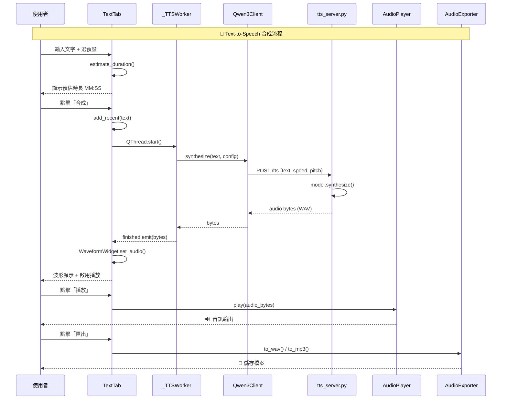
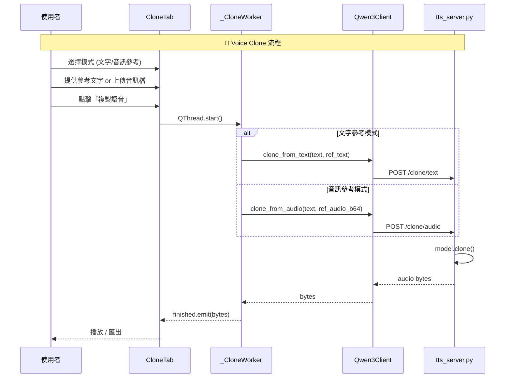
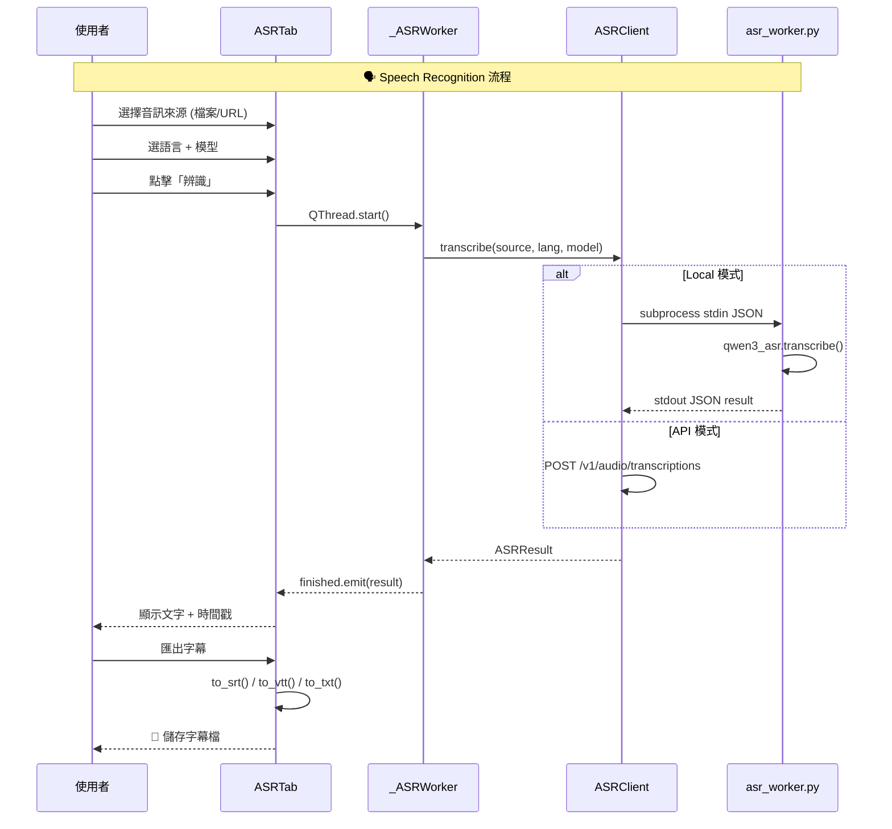
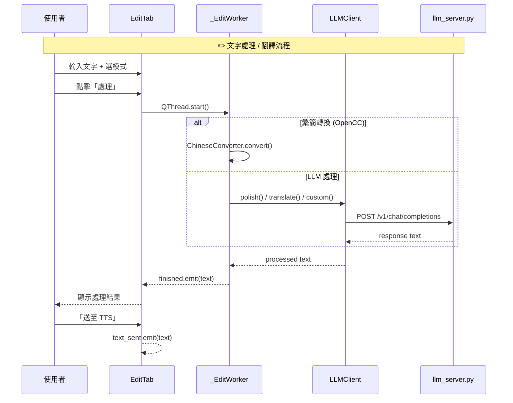

# Qwen3-TTS App — Architecture Knowledge Graph

> 自動產生於 v0.3.0　｜　最後更新: 2025-07

## 1. System Architecture

```mermaid
graph TB
    subgraph Entry["🚀 Entry Point"]
        main["app/main.py<br/>main()"]
    end

    subgraph UI["🖥️ UI Layer — PySide6"]
        MW["MainWindow<br/>QMainWindow"]
        TT["TextTab<br/>TTS 合成"]
        CT["CloneTab<br/>語音複製"]
        ET["EditTab<br/>文字處理"]
        AT["ASRTab<br/>語音辨識"]
        HT["HistoryTab<br/>歷史紀錄"]
        ST["SettingsTab<br/>設定"]
        TH["theme.py<br/>Dark Theme"]
        WF["WaveformWidget<br/>波形顯示"]
    end

    subgraph Core["⚙️ Core Layer"]
        CFG["config.py<br/>Config YAML"]
        HIS["history.py<br/>HistoryManager"]
        SSML["ssml.py<br/>SSML Tags"]
        DUR["duration_estimator.py<br/>時長預估"]
        REC["recent_texts.py<br/>最近文字"]
        I18N["i18n.py<br/>國際化"]
        LOG["app_logger.py<br/>Rotating Log"]
        CHN["chinese_converter.py<br/>OpenCC 繁簡轉換"]
        PRE["presets.py<br/>Voice Presets"]
        DRF["drafts.py<br/>Auto-save Drafts"]
    end

    subgraph Audio["🔊 Audio Layer"]
        PLY["player.py<br/>QMediaPlayer"]
        EXP["exporter.py<br/>WAV / MP3"]
        CAT["concatenator.py<br/>音訊拼接"]
    end

    subgraph API["🌐 API Client Layer"]
        Q3C["qwen3_client.py<br/>Qwen3 TTS REST"]
        LLM["llm_client.py<br/>Multi-Provider LLM"]
        OLL["ollama_client.py<br/>Ollama API"]
        ASR["asr_client.py<br/>ASR Local/Remote"]
        EXC["exceptions.py<br/>APIError / TTSError"]
    end

    subgraph Scripts["📡 Server Scripts"]
        TTS_S["tts_server.py<br/>FastAPI :8000"]
        LLM_S["llm_server.py<br/>FastAPI :8001"]
        ASR_W["asr_worker.py<br/>Subprocess stdin/out"]
        DL["download_models.py<br/>模型下載"]
    end

    subgraph Data["💾 Persistent Data"]
        YAML_CFG["config.yaml"]
        YAML_HIS["data/history.yaml"]
        YAML_REC["data/recent_texts.yaml"]
        YAML_DRF["data/drafts.yaml"]
        YAML_PRE["data/presets.yaml"]
        LOG_F["data/app.log"]
    end

    %% Entry → UI
    main --> MW
    main --> TH
    main --> CFG
    main --> Q3C
    main --> OLL
    main --> LLM
    main --> ASR
    main --> HIS

    %% MainWindow → Tabs
    MW --> TT
    MW --> CT
    MW --> ET
    MW --> AT
    MW --> HT
    MW --> ST
    MW --> LOG

    %% TextTab dependencies
    TT --> Q3C
    TT --> PLY
    TT --> EXP
    TT --> CAT
    TT --> WF
    TT --> SSML
    TT --> DUR
    TT --> REC
    TT --> PRE
    TT --> DRF
    TT --> HIS

    %% CloneTab dependencies
    CT --> Q3C
    CT --> PLY
    CT --> EXP
    CT --> HIS

    %% EditTab dependencies
    ET --> LLM
    ET --> OLL
    ET --> CHN
    ET --> HIS

    %% ASRTab dependencies
    AT --> ASR

    %% HistoryTab dependencies
    HT --> HIS

    %% SettingsTab dependencies
    ST --> CFG

    %% API → Servers
    Q3C -.->|HTTP :8000| TTS_S
    LLM -.->|HTTP :8001| LLM_S
    OLL -.->|HTTP :11434| LLM_S
    ASR -.->|subprocess| ASR_W

    %% Core → Data
    CFG --> YAML_CFG
    HIS --> YAML_HIS
    REC --> YAML_REC
    DRF --> YAML_DRF
    PRE --> YAML_PRE
    LOG --> LOG_F

    %% API error handling
    Q3C --> EXC
    LLM --> EXC
    OLL --> EXC
    ASR --> EXC

    %% Styling
    classDef entry fill:#6C63FF,stroke:#333,color:#fff
    classDef ui fill:#4ECDC4,stroke:#333,color:#000
    classDef core fill:#FFE66D,stroke:#333,color:#000
    classDef audio fill:#FF6B6B,stroke:#333,color:#fff
    classDef api fill:#A8DADC,stroke:#333,color:#000
    classDef script fill:#457B9D,stroke:#333,color:#fff
    classDef data fill:#E9C46A,stroke:#333,color:#000

    class main entry
    class MW,TT,CT,ET,AT,HT,ST,TH,WF ui
    class CFG,HIS,SSML,DUR,REC,I18N,LOG,CHN,PRE,DRF core
    class PLY,EXP,CAT audio
    class Q3C,LLM,OLL,ASR,EXC api
    class TTS_S,LLM_S,ASR_W,DL script
    class YAML_CFG,YAML_HIS,YAML_REC,YAML_DRF,YAML_PRE,LOG_F data
```



## 2. TTS Synthesis — Data Flow



## 3. Voice Clone — Data Flow



## 4. ASR Transcription — Data Flow



## 5. LLM Text Processing — Data Flow



## 6. Module Dependency Matrix

| Module | Depends On | Depended By |
|--------|-----------|-------------|
| `config.py` | PyYAML | main.py, SettingsTab |
| `history.py` | PyYAML | main.py, TextTab, CloneTab, EditTab, HistoryTab |
| `ssml.py` | (stdlib) | TextTab |
| `duration_estimator.py` | (stdlib) | TextTab |
| `recent_texts.py` | PyYAML | TextTab |
| `i18n.py` | (stdlib) | (ready for UI integration) |
| `app_logger.py` | (stdlib) | MainWindow |
| `chinese_converter.py` | opencc | EditTab |
| `presets.py` | PyYAML | TextTab |
| `drafts.py` | PyYAML | TextTab |
| `player.py` | PySide6.QtMultimedia | TextTab, CloneTab |
| `exporter.py` | soundfile, pydub | TextTab, CloneTab |
| `concatenator.py` | soundfile, numpy | TextTab |
| `qwen3_client.py` | requests | TextTab, CloneTab |
| `llm_client.py` | requests | EditTab |
| `ollama_client.py` | requests | EditTab |
| `asr_client.py` | requests, subprocess | ASRTab |
| `theme.py` | PySide6 | MainWindow, all Tabs |

## 7. Layer Architecture Summary

```
┌─────────────────────────────────────────────────┐
│                  app/main.py                     │  Entry
├─────────────────────────────────────────────────┤
│  MainWindow │ TextTab │ CloneTab │ EditTab │ ... │  UI (PySide6)
├─────────────┼─────────┼──────────┼─────────┼─────┤
│  config │ history │ ssml │ i18n │ presets │ ...  │  Core
├─────────────┼─────────┼──────────┼─────────┼─────┤
│  player │ exporter │ concatenator                │  Audio
├─────────────┼─────────┼──────────────────────────┤
│  qwen3_client │ llm_client │ asr_client          │  API Clients
├─────────────┼─────────┼──────────────────────────┤
│  tts_server │ llm_server │ asr_worker            │  Scripts (FastAPI)
├─────────────┼─────────┼──────────────────────────┤
│  config.yaml │ data/*.yaml │ data/app.log        │  Persistence
└─────────────┴─────────┴──────────────────────────┘
```
